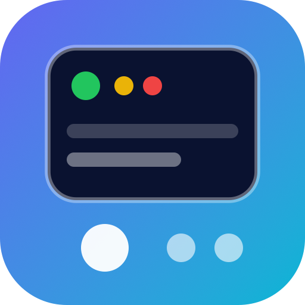

<div align="center">
  
  <h1>DevDex</h1>
  <p><strong>Il Pokédex dello sviluppatore.</strong><br>
  Un’enciclopedia tascabile per studiare, ripassare prima di un colloquio e mettersi alla prova con quiz e flashcard.</p>
  <p>
    <a href="https://carellice.github.io/devdex/"></a>
  </p>
  <p>
    
    
    
    
  </p>
</div>

## Cos’è

DevDex raccoglie in un unico posto i concetti che uno sviluppatore incontra davvero: Java, Spring, database, architetture, API e intelligenza artificiale. Ogni argomento è spiegato su **tre livelli di profondità** — principiante, medio e avanzato — così puoi partire dalle basi o andare dritto ai dettagli.

Si usa dal browser, senza account: progressi e preferenze restano salvati sul tuo dispositivo.

**👉 [carellice.github.io/devdex](https://carellice.github.io/devdex/)**

## A chi serve

- **A chi parte da zero:** il percorso guidato *Start here* accompagna dai primi concetti di programmazione alla scelta di un linguaggio.
- **A chi prepara un colloquio:** ripasso veloce per argomento, poi quiz e flashcard per verificare cosa è rimasto.
- **A chi lavora già:** una consultazione rapida quando serve rinfrescare un concetto.

## Cosa trovi dentro

| Area | Argomenti |
|---|---|
| **Fondamenti** | Basi di programmazione, come funzionano i linguaggi |
| **Linguaggi** | Java: OOP, immutabilità, stream, varargs, lazy evaluation, callback, programmazione asincrona, `CompletableFuture`, `ForkJoinPool` |
| **Framework** | Spring (Boot, Cloud, AOP, dependency injection, `@Transactional`, DispatcherServlet, RestTemplate e WebClient), Quarkus, Vite + React |
| **Database & Persistence** | ACID, indici, JDBC e Hibernate, analisi delle query, SQL e NoSQL |
| **Architettura & API** | Microservizi, REST / SOAP / RPC, GraphQL, ciclo di vita del software, convenzioni Git |
| **AI & LLM** | Intelligenza artificiale, Spring AI |
| **Approfondimenti & Curiosità** | JVM internals, design pattern, Swift su Android |

## Funzionalità

- **Tre livelli per argomento:** principiante, medio e avanzato, con esempi di codice evidenziati.
- **Quiz** generali o per categoria, con punteggio e riepilogo finale.
- **Flashcard** da sfogliare in ordine o in modalità casuale.
- **Progressi:** livelli completati, quiz svolti e miglior risultato sempre a portata di mano.
- **Ricerca** su tutti i contenuti.
- **Italiano e inglese:** ogni contenuto è disponibile in entrambe le lingue.
- **Tema chiaro, scuro o automatico** e opzione per ridurre le animazioni.
- **Esporta e importa** i tuoi progressi in un file, per spostarli su un altro dispositivo o farne una copia.

## Come si usa

1. **Apri il sito** e scegli da dove partire: il percorso *Start here*, una delle sezioni o la ricerca.
2. **Leggi un argomento** scegliendo il livello adatto a te e segnalo come completato.
3. **Mettiti alla prova** con quiz e flashcard, poi controlla l’andamento nella pagina *Progressi*.

> I dati vivono solo nel browser che stai usando. Per non perderli quando cambi dispositivo o svuoti i dati del browser, esportali da *Impostazioni*.

## Avvio in locale

Serve [Node.js](https://nodejs.org/) 22.13 o superiore.

**Con doppio clic**

- **macOS:** apri `Avvia DevDex.command`
- **Windows:** apri `Avvia DevDex.bat`

Al primo avvio vengono installate le dipendenze, poi l’app si apre nel browser.

**Da terminale**

```bash
npm install
```

```bash
npm run dev
```

L’app si apre su `http://127.0.0.1:5174`.

Per creare la build di produzione nella cartella `dist`:

```bash
npm run build
```

## Pubblicazione

Ogni push sul ramo `main` avvia il workflow [deploy-pages.yml](.github/workflows/deploy-pages.yml), che compila il progetto e lo pubblica su GitHub Pages.

## Struttura del progetto

```text
src/
├── content/      # Contenuti in MDX, divisi per area
├── data/         # Catalogo, quiz, flashcard, traduzioni e indice di ricerca
├── pages/        # Home, argomenti, quiz, flashcard, progressi, impostazioni
├── components/   # Layout, navigazione e componenti condivisi
├── context/      # Tema, lingua, preferenze e progressi
└── styles/       # Stile globale
public/           # Logo e icone
```

## Aggiungere un contenuto

Ogni argomento è un insieme di file MDX in `src/content/<area>/`, uno per livello e per lingua:

```text
graphql.principiante.mdx      # italiano
graphql.principiante.en.mdx   # inglese
graphql.medio.mdx
graphql.avanzato.mdx
```

Dopo aver creato i file, registra l’argomento in [src/data/catalog.js](src/data/catalog.js) perché compaia nell’app.

## Tecnologie

React 19, React Router, MDX e Vite.
